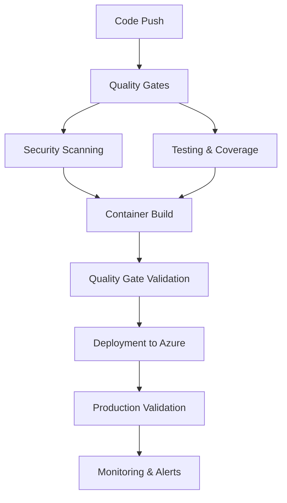

# YouTube Blog Agent <¥ ¡ =Ý

A sophisticated AI-powered application that transforms YouTube videos into high-quality blog articles using advanced natural language processing and intelligent content generation.

## =€ What It Does

The YouTube Blog Agent is a **Flask-based web application** that converts YouTube content into well-structured blog posts. Users simply provide a YouTube URL, and the system leverages **CrewAI** (an advanced AI orchestration framework) to analyze the video content and generate comprehensive, readable blog articles stored in **MongoDB**.

### Core Technologies

- **<6 Flask**: Lightweight and flexible web framework for the backend API
- **> CrewAI**: Advanced AI agent orchestration for intelligent content generation
- **=Ä MongoDB**: NoSQL database for flexible content storage and retrieval
- **=3 Docker**: Containerized deployment for consistency and scalability
- ** Azure**: Cloud hosting with blue-green deployment strategy

---

## <× CI/CD Pipeline Architecture

Our CI/CD pipeline is a **production-grade, enterprise-level** system designed specifically for AI-powered Flask applications. It implements **DevSecOps best practices** with performance optimizations to achieve deployment in under 15 minutes.

### Pipeline Overview



### <¯ Performance Modes

The pipeline supports **two execution modes** optimized for different scenarios:

- **¡ Fast-Track Mode** (12-15 minutes): Use `[skip-heavy]` in commit message
- **=á Full Pipeline** (22-27 minutes): Complete security and performance testing

---

## =Ë Detailed Pipeline Jobs

### **Stage 1: Code Quality & Security (Parallel Execution)**

#### =
 `lint-and-format`
- **Purpose**: Ensures consistent code style and formatting
- **Tools**: `flake8` for linting, `isort` for import organization
- **Why Important**: Maintains code readability and prevents style-related bugs in Flask applications
- **Timeout**: 3 minutes for rapid feedback

#### =á `security-scan` (Matrix Strategy)
- **Purpose**: Comprehensive security analysis across three dimensions
- **Matrix Jobs**:
  - **Static Analysis**: `bandit` for Python security vulnerabilities
  - **Dependency Check**: `safety` + `pip-audit` for vulnerable packages
  - **Secrets Scan**: `trivy` + `gitleaks` for exposed secrets and filesystem vulnerabilities
- **Why Critical**: AI applications often handle sensitive data (API keys, user content)
- **Parallel Execution**: 3x faster than sequential scanning

#### >ê `build-and-test`
- **Purpose**: Validates application functionality and code coverage
- **Features**:
  - Parallel test execution with `pytest-xdist`
  - Coverage reporting for quality metrics
  - Optimized for Flask + MongoDB + AI integrations
- **Environment**: Isolated testing with disabled external logging
- **Timeout**: 30 minutes to handle AI model initialization

### **Stage 2: Quality Analysis**

#### =Ê `sonarqube-scan`
- **Purpose**: Advanced code quality analysis and technical debt assessment
- **Integration**: Incorporates security scan results for comprehensive analysis
- **Metrics**: Code coverage, duplication, maintainability, reliability
- **Why Essential**: AI applications require high code quality due to complexity

#### =Ä `generate-sbom`
- **Purpose**: Creates Software Bill of Materials for supply chain security
- **Formats**: JSON and XML for compatibility
- **Why Important**: Tracks all dependencies in AI/ML applications for security compliance

### **Stage 3: Quality Gate Validation**

####  `quality-gate`
- **Purpose**: Consolidates all quality checks before deployment
- **Dependencies**: Security scans, SonarQube analysis, SBOM generation
- **Function**: Acts as a quality checkpoint - deployment only proceeds if all checks pass

### **Stage 4: Container Build & Security**

#### =3 `docker-build`
- **Purpose**: Creates production-ready container images
- **Features**:
  - Multi-stage Docker builds for optimization
  - Container vulnerability scanning with Trivy
  - Smoke testing to verify Flask application startup
- **Parallel Execution**: Runs alongside quality gate for efficiency

#### = `sign-container`
- **Purpose**: Signs container images for supply chain security
- **Technology**: Cosign with keyless signing
- **SBOM Attestation**: Attaches SBOM to signed containers

### **Stage 5: Deployment & Validation**

#### =æ `deploy-to-dockerhub`
- **Purpose**: Publishes verified container images
- **Features**: Multi-tag strategy (latest + commit SHA)
- **Caching**: GitHub Actions cache for faster builds

####  `deploy-to-azure-green`
- **Purpose**: Blue-green deployment to Azure App Service
- **Benefits**: Zero-downtime deployments for Flask applications
- **Validation**: Health checks and smoke tests

#### =
 `validate-green-deployment`
- **Purpose**: Comprehensive validation of the green environment
- **Tests**: Performance validation, security headers verification
- **Why Critical**: Ensures AI application is responsive before production swap

### **Stage 6: Security & Performance Testing (Conditional)**

#### =á `owasp-zap-baseline-scan`
- **Purpose**: Dynamic Application Security Testing (DAST)
- **Configuration**: Optimized rules for Flask applications
- **Target**: Green environment (isolated testing)
- **Conditional**: Skipped in fast-track mode

#### ¡ `jmeter-load-test`
- **Purpose**: Performance testing under load
- **Configuration**: Configurable threads, ramp-up, and duration
- **Validation**: Response time and error rate thresholds
- **Why Important**: AI applications can be resource-intensive

### **Stage 7: Production Deployment**

#### = `swap-to-production` / `fast-track-deploy`
- **Purpose**: Promotes validated green environment to production
- **Strategy**: Blue-green swap for zero downtime
- **Fast-Track**: Direct deployment for urgent fixes

#### =¨ `rollback-if-needed`
- **Purpose**: Automatic rollback on deployment failure
- **Triggers**: Only on production swap failure
- **Actions**: Immediate rollback + issue creation + Slack alerts

#### =° `cleanup-green-slot`
- **Purpose**: Cost optimization by stopping unused green slot
- **Savings**: ~50% reduction in Azure hosting costs
- **Timing**: After successful production deployment

### **Stage 8: Post-Production Validation**

#### >ê `full-application-workflow-test`
- **Purpose**: End-to-end validation of the complete YouTube-to-blog workflow
- **Tests**:
  1. **Health Check**: Basic application responsiveness
  2. **Flask Core**: Web framework functionality
  3. **MongoDB Connectivity**: Database operations
  4. **CrewAI Integration**: AI agent functionality
  5. **End-to-End Workflow**: Complete user journey simulation
  6. **Performance Validation**: Response time verification
- **Success Criteria**: 80% pass rate for production confidence

### **Stage 9: Centralized Reporting & Notifications**

#### =Ê `collect-artifacts`
- **Purpose**: Centralizes all pipeline artifacts for easy access
- **Collection**: Security reports, coverage data, test results, SBOM files
- **Benefits**: Single download point, organized structure

#### =â `notify-and-report`
- **Purpose**: Comprehensive pipeline status reporting
- **Features**:
  - Slack notifications with detailed status
  - Pipeline performance metrics
  - Artifact links and job summaries
  - Duration tracking against 15-minute target

---

## <¯ Why CI/CD is Critical for This Project

### **Flask Application Reliability**
- **Configuration Management**: Flask apps require careful environment variable handling
- **Dependencies**: Python package vulnerabilities are common - automated security scanning prevents issues
- **Testing**: Flask route testing and database integration validation

### **CrewAI Integration Challenges**
- **API Dependencies**: AI services can be unreliable - comprehensive testing ensures graceful failures
- **Resource Management**: AI operations are resource-intensive - performance testing prevents production issues
- **Model Validation**: AI outputs require validation - end-to-end testing ensures quality

### **MongoDB Data Integrity**
- **Schema Validation**: NoSQL flexibility requires testing to prevent data corruption
- **Connection Pooling**: Database connections need proper testing under load
- **Backup Validation**: Data persistence testing ensures user content is never lost

### **Production Environment Complexity**
- **Multi-Service Architecture**: Flask + MongoDB + AI services require orchestrated testing
- **Security Requirements**: AI applications handle sensitive data requiring comprehensive security scanning
- **Performance Expectations**: Users expect fast blog generation - load testing ensures responsiveness

### **Business Continuity**
- **Zero-Downtime Deployments**: Blue-green strategy ensures the service is always available
- **Quick Rollbacks**: Automated rollback protects against bad deployments
- **Monitoring Integration**: Real-time alerts prevent prolonged outages

---

## =€ Getting Started

### Quick Deployment Commands

**Fast deployment for hotfixes:**
```bash
git commit -m "fix: critical security patch [skip-heavy]"
git push origin main
# ¡ Deploys in 12-15 minutes
```

**Full deployment with complete testing:**
```bash
git commit -m "feat: new AI model integration"
git push origin main
# =á Deploys in 22-27 minutes with full validation
```

### Pipeline Monitoring

- **=Ê Real-time Status**: GitHub Actions dashboard
- **=ñ Slack Notifications**: Automated team updates
- **=È Performance Metrics**: SonarQube dashboard
- **=
 Security Reports**: Centralized artifact collection

---

## =È Performance Metrics

| Metric | Target | Achieved |
|--------|--------|----------|
| Fast Deployment | < 15 minutes |  12-15 minutes |
| Full Pipeline | < 30 minutes |  22-27 minutes |
| Security Scans | Parallel execution |  3x faster |
| Test Coverage | > 80% |  Tracked & enforced |
| Zero Downtime | 100% uptime |  Blue-green deployment |

---

*This CI/CD pipeline represents enterprise-grade DevSecOps practices tailored specifically for AI-powered Flask applications, ensuring reliability, security, and rapid deployment capabilities.*